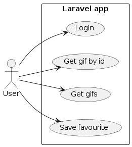
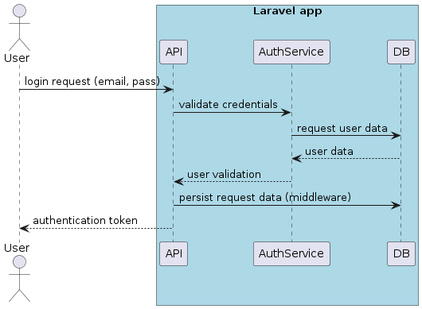
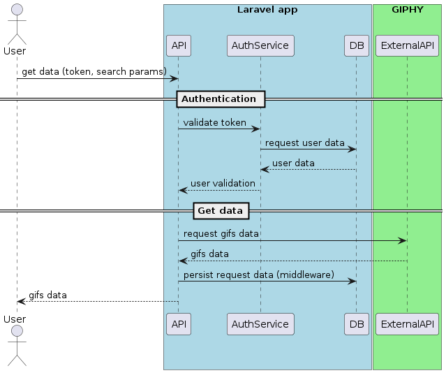
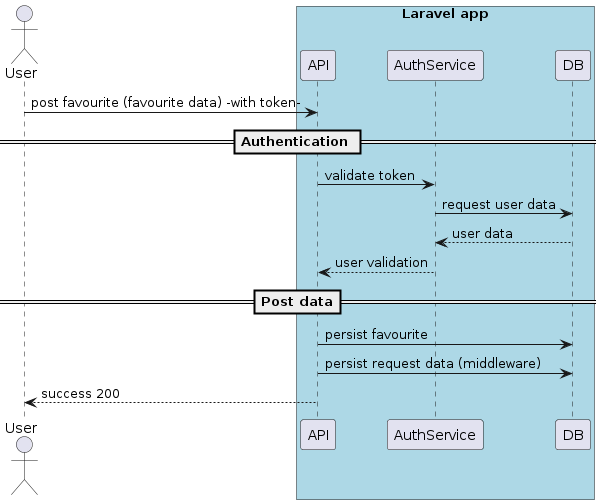
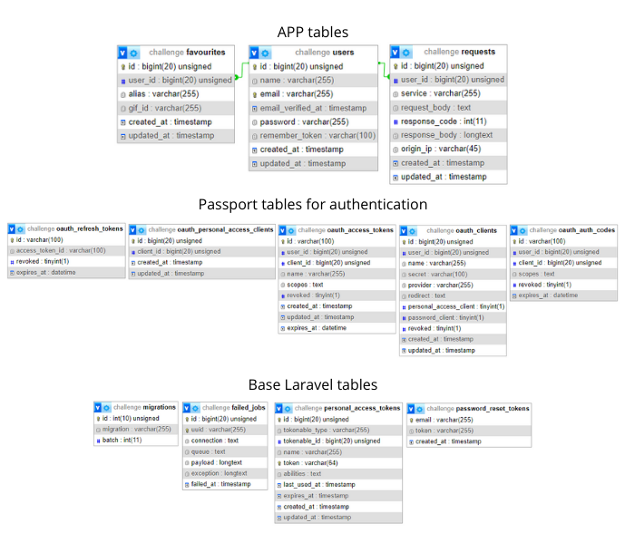

# Laravel challenge

## Description
This is a Laravel app for training purposes using OAuth2 and integrating with the GIPHY API.

## Main stack
* Laravel 10 (using Passport for authentication and Guzzle for HTTP requests)
* PHP 8.2
* MySQL 8
* Docker

## Instalation (without Docker)
**Note**: it is necessary to have installed Git, Composer, PHP and MySQL (XAMPP recommended).

1. Clone the repository.
2. Move to the "laravel" folder.
3. Run `composer install`.
4. Copy the .env.example into a .env file.
5. Complete the value for GIPHY_KEY in the .env file.
6. Change the DB connection settings in the .env.
7. Run `php artisan migrate` to create the tables of the DB.
8. Run `php artisan passport:install` to generate the necessary data for the authentication service.
9. Run `php artisan serve`.
10. The application should be running in port 8000.

## Instalation (with Docker)
**Note**: it is necessary to have installed Git and Docker.

1. Clone the repository
2. Move to the "laravel" folder.
3. Copy the .env.example into a .env file.
4. Complete the value for GIPHY_KEY in the .env file.
5. Move to the root directory where the docker-compose.yml file is located and run `docker-compose up --build -d`.
6. Run `docker exec -it laravel-app bash` in order to access the Docker container that has the Laravel app.
7. Run `mysql -u root -p -h db -P 3306` and put the correct password which is contained in the docker-compose.yml. This step is vital to allow the connection between the MySQL and the Laravel containers.
8. Inside the Laravel container, run `php artisan migrate` to create the tables of the DB.
9. Also run  `php artisan passport:install` to generate the necessary data for the authentication service.
10. The applicatoin should be running in port 8000.

**Note**: a register method was added in order to create users. It has not been included in the diagrams because it was not part of the requirements. However, the Postman request for this has indeed been included.

## Postman
### Auth
#### Register
```json
{
    "name": "Register",
    "request": {
        "method": "POST",
        "header": [],
        "body": {
            "mode": "raw",
            "raw": "{\r\n    \"name\": \"Test name\",\r\n    \"email\": \"test@example.com\",\r\n    \"password\": \"1234\"\r\n}",
            "options": {
                "raw": {
                    "language": "json"
                }
            }
        },
        "url": {
            "raw": "http://localhost:8000/api/auth/register",
            "protocol": "http",
            "host": [
                "localhost"
            ],
            "port": "8000",
            "path": [
                "api",
                "auth",
                "register"
            ]
        }
    }
}
```

#### Login
```json
{
    "name": "Login",
    "event": [
        {
            "listen": "test",
            "script": {
                "exec": [
                    "pm.test(\"Save login token\", function () {\r",
                    "    var jsonData = pm.response.json();\r",
                    "    pm.globals.set(\"accessToken\", jsonData.access_token);\r",
                    "});"
                ],
                "type": "text/javascript",
                "packages": {}
            }
        }
    ],
    "request": {
        "method": "POST",
        "header": [],
        "body": {
            "mode": "raw",
            "raw": "{\r\n    \"email\": \"test@example.com\",\r\n    \"password\": \"1234\" \r\n}",
            "options": {
                "raw": {
                    "language": "json"
                }
            }
        },
        "url": {
            "raw": "http://localhost:8000/api/auth/login",
            "protocol": "http",
            "host": [
                "localhost"
            ],
            "port": "8000",
            "path": [
                "api",
                "auth",
                "login"
            ]
        }
    }
}
```

### Gifs
#### Get by id
```json
{
    "name": "Get by id",
    "request": {
        "auth": {
            "type": "bearer",
            "bearer": [
                {
                    "key": "token",
                    "value": "{{accessToken}}",
                    "type": "string"
                }
            ]
        },
        "method": "GET",
        "header": [],
        "url": {
            "raw": "http://localhost:8000/api/gifs/WtDLxQWQWLtw3oIXTy",
            "protocol": "http",
            "host": [
                "localhost"
            ],
            "port": "8000",
            "path": [
                "api",
                "gifs",
                "WtDLxQWQWLtw3oIXTy"
            ]
        }
    }
}
```

#### Get by params
```json
{
    "name": "Get multiple",
    "request": {
        "auth": {
            "type": "bearer",
            "bearer": [
                {
                    "key": "token",
                    "value": "{{accessToken}}",
                    "type": "string"
                }
            ]
        },
        "method": "GET",
        "header": [],
        "url": {
            "raw": "http://localhost:8000/api/gifs?query=example&limit=2&offset=0",
            "protocol": "http",
            "host": [
                "localhost"
            ],
            "port": "8000",
            "path": [
                "api",
                "gifs"
            ],
            "query": [
                {
                    "key": "query",
                    "value": "example"
                },
                {
                    "key": "limit",
                    "value": "2"
                },
                {
                    "key": "offset",
                    "value": "0"
                }
            ]
        }
    }
}
```

#### Save favourite
```json
{
    "name": "Post favourite",
    "request": {
        "auth": {
            "type": "bearer",
            "bearer": [
                {
                    "key": "token",
                    "value": "{{accessToken}}",
                    "type": "string"
                }
            ]
        },
        "method": "POST",
        "header": [],
        "body": {
            "mode": "raw",
            "raw": "{\r\n    \"user_id\": 1,\r\n    \"alias\": \"alias example\",\r\n    \"gif_id\": \"WtDLxQWQWLtw3oIXTy\"\r\n}",
            "options": {
                "raw": {
                    "language": "json"
                }
            }
        },
        "url": {
            "raw": "http://localhost:8000/api/gifs",
            "protocol": "http",
            "host": [
                "localhost"
            ],
            "port": "8000",
            "path": [
                "api",
                "gifs"
            ]
        }
    }
}
```

## Diagrams
### Use case diagram


### Sequence diagrams

#### Login


#### Get gif by id and get gifs


#### Save favourite


### DER


## Tests
Tests can be found in laravel/tests/Feature.

In order to run tests, run `php artisan test` in "laravel" folder.


